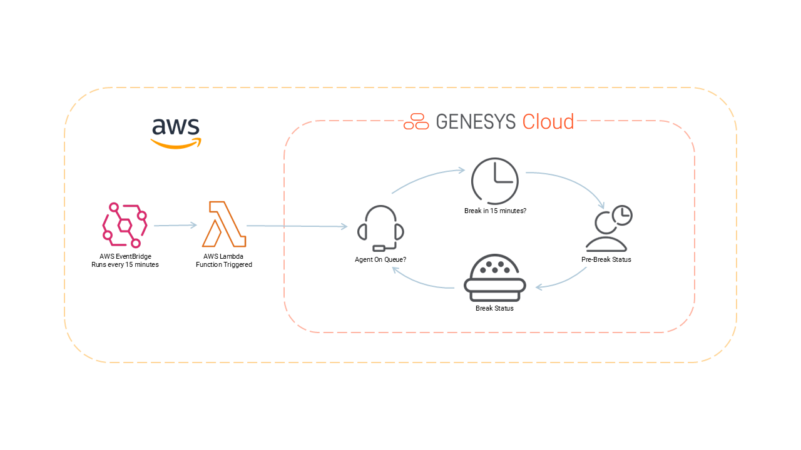

# Genesys Cloud Agent Presence Automation Blueprint

> View the full [Genesys Cloud Agent Presence Automation Blueprint](https://developer.mypurecloud.com/blueprints/agent-utilization-and-adherence/ "Goes to the agent-utilization-and-adherence repo") in the Genesys Cloud Developer Center.

This blueprint demonstrates how to automatically update Genesys Cloud agent presence status based on scheduled breaks. The solution monitors agent schedules and proactively sets agents to a "Pre-Break" presence 15 minutes before their scheduled break time. This solution is implemented using AWS EventBridge that runs an AWS Lambda function every 15 minutes. You can deploy all components used in this solution with the AWS Terraform provider or by deploying with AWS CloudFormation.



# To Deploy
- Package the Lambda:

  ```bash
  npm install --production
  zip -r genesys-lambda.zip lambda-genesys.js node_modules/
  ```

- Deploy with CloudFormation:
  ```bash
  aws cloudformation create-stack \
  --stack-name genesys-presence-updater \
  --template-body file://genesys-lambda-template.yaml \
  --parameters ParameterKey=GenesysClientId,ParameterValue=your_client_id \
      ParameterKey=GenesysClientSecret,ParameterValue=your_client_secret \
  --capabilities CAPABILITY_IAM
  ```

The Lambda will automatically run every 15 minutes using EventBridge (CloudWatch Events) with the schedule expression rate(15 minutes).

##
- To check which account:
  ```bash
  aws sts get-caller-identity
  ```
  This shows your current AWS account ID, user/role, and ARN.

- To check your configured credentials:
  ```bash
  aws configure list
  ```

- To use a different account:
  - Set different credentials: aws configure
  - Use a profile: aws cloudformation create-stack --profile your-profile-name
  - Use environment variables:

    ```bash
      export AWS_ACCESS_KEY_ID=your-key
      export AWS_SECRET_ACCESS_KEY=your-secret
      export AWS_DEFAULT_REGION=us-east-1
    ```

  The deployment uses whatever AWS credentials are currently active in your environment.

# AWS objects to be configured

### Lambda Function
  - **Name**: genesys-presence-updater
  - **Runtime**: Node.js 18.x
  - **Timeout**: 60 seconds
  - **Environment Variables**: Genesys credentials and IDs

### IAM Role
  - **Purpose**: Lambda execution role
  - **Permissions**: Basic Lambda execution (CloudWatch Logs)
  - **Trust Policy**: Allows Lambda service to assume the role

### EventBridge Rule (CloudWatch Events)
  - **Schedule**: rate(15 minutes) - triggers every 15 minutes
  - **Target**: The Lambda function
  - **State**: ENABLED (automatically starts running)

### Lambda Permission
  - **Purpose**: Allows EventBridge to invoke the Lambda function
  - **Principal**: events.amazonaws.com

### Total AWS Resources Created: 4
1. Lambda Function
2. IAM Role
3. EventBridge Rule
4. Lambda Permission

### Cost Impact:
- Lambda: Pay per execution ~$0.58 USD (2,880 executions × $0.0000002 per request)
- EventBridge: Pay per rule evaluation ~$0.00 USD (2,880 events × $0.000001 per event = $0.003)
- IAM Role: Free
- CloudWatch Logs: Pay for log storage ~$0.50 USD (depends on log volume)

# Check Lambda Status

## AWS Console
1. Go to AWS Lambda console
2. Find function genesys-presence-updater
3. Check "Monitoring" tab for execution metrics

AWS CLI:
```bash
# Check function exists
aws lambda get-function --function-name genesys-presence-updater

# Check recent invocations
aws lambda get-function --function-name genesys-presence-updater --query 'Configuration.LastModified'
```

Check CloudWatch Logs:
```bash
# List log groups
aws logs describe-log-groups --log-group-name-prefix "/aws/lambda/genesys-presence-updater"

# Get recent logs
aws logs describe-log-streams --log-group-name "/aws/lambda/genesys-presence-updater"
```

Check EventBridge Schedule:
```bash
# Check if rule is enabled
aws events describe-rule --name [rule-name-from-stack]
```

## Monitor Execution
### CloudWatch Metrics to watch
- **Invocations**: Number of times function ran
- **Duration**: How long each execution took
- **Errors**: Failed executions
- **Throttles**: Rate-limited executions

### Quick Test
```bash
# Manually invoke to test
aws lambda invoke --function-name genesys-presence-updater response.json
cat response.json
```

The function should show logs every 15 minutes in CloudWatch if working properly.


# To delete all AWS objects created by this blueprint
- For Terraform deployment
  ```bash
  cd blueprint/source/terraform
  terraform destroy
  ```

- For CloudFormation deployment
  ```bash
  aws cloudformation delete-stack --stack-name genesys-presence-updater
  ```

- Manual cleanup (if needed)
  ```bash
  # Delete Lambda function
  aws lambda delete-function --function-name genesys-presence-updater

  # Delete CloudWatch log group
  aws logs delete-log-group --log-group-name /aws/lambda/genesys-presence-updater

  # Delete EventBridge rule
  aws events remove-targets --rule genesys-presence-schedule --ids GenesysTarget
  aws events delete-rule --name genesys-presence-schedule

  # Delete IAM role (detach policies first)
  aws iam detach-role-policy --role-name genesys-lambda-role --policy-arn arn:aws:iam::aws:policy/service-role/AWSLambdaBasicExecutionRole
  aws iam delete-role --role-name genesys-lambda-role
  ```