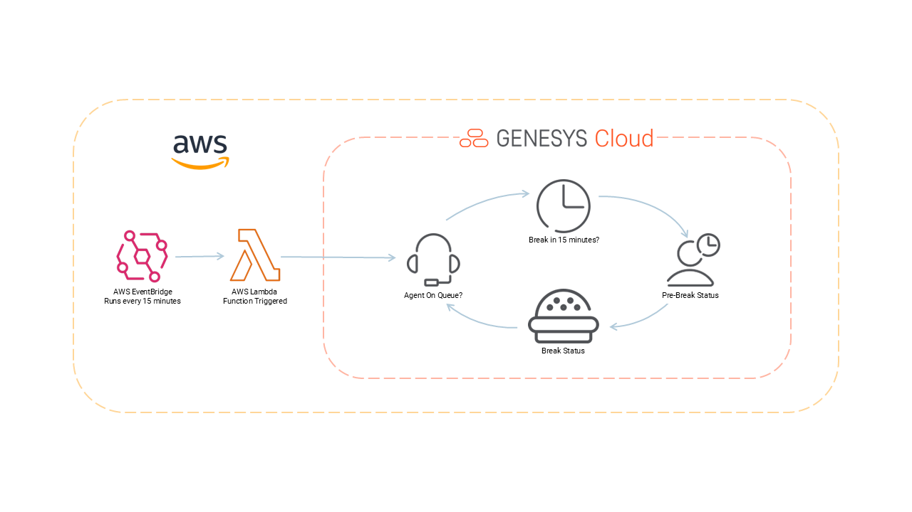

:::{"alert":"primary","title":"About Genesys Cloud Blueprints","autoCollapse":false} 
Genesys Cloud blueprints were built to help you jump-start building an application or integrating with a third-party partner. 
Blueprints are meant to outline how to build and deploy your solutions, not a production-ready turn-key solution.
 
For more details on Genesys Cloud blueprint support and practices 
please see our Genesys Cloud blueprint [FAQ](https://developer.genesys.cloud/blueprints/faq) sheet.
:::

This blueprint demonstrates how to automatically update Genesys Cloud agent presence status based on scheduled breaks. The solution monitors agent schedules and proactively sets agents to a "Pre-Break" presence 15 minutes before their scheduled break time. This solution is implemented using AWS EventBridge that runs an AWS Lambda function every 15 minutes. You can deploy all components used in this solution with the AWS Terraform provider or by deploying with AWS CloudFormation.



## Scenario
When an agent goes to lunch or break and is taking two chats concurrently, the only way to stop additional chats from coming in is to go **Off Queue** or put themselves in **Available**. On busy days, the agents are struggling with maintaining their adherence because of going off queue or going into available while waiting for the other interaction to wrap up.

1. AWS EventBridge runs every 15 minutes.
2. AWS Lamba Function is triggered.
3. Agent is On Queue and handling interactions.
4. Agent break schedule is in 15 minutes.
5. The solution automatically updates agent's status to "Pre-Break".
6. Agent no longer receives inbound interactions and will be on time for scheduled break.

## Architecture

The solution uses AWS Lambda to:
- Query Genesys Cloud for active agents and their current presence
- Retrieve agent schedules from Workforce Management
- Identify agents with upcoming breaks (within 15 minutes)
- Update agent presence to "Pre-Break" status

## Solution components
* **Genesys Cloud** - A suite of Genesys cloud services for enterprise-grade communications, collaboration, and contact center management. Contact center agents use the Genesys Cloud user interface.
* **Genesys Cloud API** - A set of RESTful APIs that enables you to extend and customize your Genesys Cloud environment.
* **[AWS Lambda](https://aws.amazon.com/lambda/ "Opens the AWS Lambda website")** - A serverless computing service for running code without creating or maintaining the underlying infrastructure.
* **[Amazon EventBridge](https://aws.amazon.com/eventbridge/ "Opens the Amazon EventBridge website")** - A scalable, serverless event bus that streams real-time data to selected targets based on custom routing rules.
* **[AWS CloudFormation](https://aws.amazon.com/cloudformation/ "Opens the AWS CloudFormation website")** - A service that gives developers and businesses an easy way to create a collection of related AWS and third-party resources, and provision and manage them in an orderly and predictable fashion.

### Software development kits (SDKs)

* **Genesys Cloud Platform API SDK** - Client libraries used to simplify application integration with Genesys Cloud by handling low-level HTTP requests. In this solution, this SDK is used for the messaging interaction between agent and customer.

## Prerequisites

### Specialized knowledge

* Administrator-level knowledge of Genesys Cloud
* AWS Cloud Practitioner-level knowledge of AWS CloudFormation, AWS IAM, AWS Lambda and Amazon EventBridge
* Experience using the Genesys Cloud Platform API

### Genesys Cloud account

* A Genesys Cloud CX 1 license. For more information, see [Genesys Cloud Pricing](https://www.genesys.com/pricing "Opens the Genesys Cloud pricing article").
* Workforce Management configured
* Custom presence definition for "Pre-Break"

### AWS user account  
* An administrator account with permissions to access the following services:
  * AWS Identity and Access Management (IAM)
  * AWS Lambda
* AWS credentials. For more information about setting up your AWS credentials on your local machine, see [The shared config and credentials files](https://docs.aws.amazon.com/sdkref/latest/guide/creds-config-files.html "Opens The shared config and credentials files on the About credential providers page") in AWS documentation.
* AWS SAM CLI version 1.23.0 or later. For more information, see [Install AWS SAM](https://docs.aws.amazon.com/serverless-application-model/latest/developerguide/serverless-sam-cli-install.html "Opens Installing AWS SAM CLI") on the AWS website.

### Development tools running in your local environment

* Terraform (the latest binary). For more information, see [Install Terraform](https://www.terraform.io/downloads.html "Goes to the Install Terraform page") on the Terraform website.

## Implementation steps

You can implement AWS objects with Terraform or using CloudFormation.
* [Configure using Terraform](#configure-using-terraform)
* [Configure using CloudFormation](#configure-using-cloudformation)

### Download the repository containing the project files

Clone the [agent-utilization-and-adherence](https://github.com/GenesysCloudBlueprints/agent-utilization-and-adherence "Goes to the agent-utilization-and-adherence") in GitHub.

## Configure using Terraform

To allow Communicate/PBX calls between Genesys Cloud users, use the **/terraform-with-pbx** folder. Otherwise, use the **/terraform-without-pbx** folder.

### Set up Genesys Cloud

1. Set the following environment variables in a terminal window before you run this project using the Terraform provider:

   * `GENESYSCLOUD_OAUTHCLIENT_ID` - This variable is the Genesys Cloud client credential grant Id that CX as Code executes against. 
   * `GENESYSCLOUD_OAUTHCLIENT_SECRET` - This variable is the Genesys Cloud client credential secret that CX as Code executes against. 
   * `GENESYSCLOUD_REGION` - This variable is the Genesys Cloud region in your organization.

2. Set the environment variables in the folder where Terraform is running. 

### Configure your Terraform build

Set the following values in the **/terraform-{with/without}-pbx/dev.auto.tfvars** file, specific to your Genesys Cloud organization:

* `client_id` - The value of your OAuth Client ID using Client Credentials to be used for the data action integration.
* `client_secret`- The value of your OAuth Client secret using Client Credentials to be used for the data action integration.
* `aws_region` - Your AWS region.
* `management_unit_id` - Your Genesys Management Unit ID.
* `pre_break_presence_id` - Pre-break presence definition ID.

The following is an example of the dev.auto.tfvars file.

```
client_id               = "your-client-id"
client_secret           = "your-client-secret"
aws_region              = "us-east-1"
management_unit_id      = "your-management-unit-id"
pre_break_presence_id   = "your-pre-break-presence-id"
```

### Run Terraform

The blueprint solution is now ready for your organization to use. 

1. Change to the **/terraform** folder and issue the following commands:

   * `terraform init` - This command initializes a working directory containing Terraform configuration files.  
   * `terraform plan` - This command executes a trial run against your Genesys Cloud organization and displays a list of all the Genesys Cloud resources Terraform created. Review this list and make sure that you are comfortable with the plan before you continue to the next step.
   * `terraform apply --auto-approve` - This command creates and deploys the necessary objects in your Genesys Cloud account. The `--auto-approve` flag provides the required approval before the command creates the objects.

After the `terraform apply --auto-approve` command successfully completes, you can see the output of the command's entire run along with the number of objects that Terraform successfully created. Keep the following points in mind:

   * This project assumes that you run this blueprint solution with a local Terraform backing state, which means that the `tfstate` files are created in the same folder where you run the project. Terraform recommends that you use local Terraform backing state files **only** if you run from a desktop or are comfortable deleting files.

   * As long as you keep your local Terraform backing state projects, you can tear down this blueprint solution. To tear down the solution, change to the `docs/terraform` folder and issue the  `terraform destroy --auto-approve` command. This command destroys all objects that the local Terraform backing state currently manages.

## Configure using CloudFormation

1. Navigate to the `source` directory
2. Package the Lambda function:
```bash
aws cloudformation package --template-file genesys-lambda-template.yaml --s3-bucket your-temp-bucket --output-template-file packaged-template.yaml
```
3. Deploy the stack:
```bash
aws cloudformation deploy --template-file packaged-template.yaml --stack-name genesys-presence-updater --parameter-overrides GenesysClientId=your-client-id GenesysClientSecret=your-secret --capabilities CAPABILITY_IAM
```

## Configuration

### Required Environment Variables

- `GENESYS_CLOUD_CLIENT_ID`: OAuth client ID
- `GENESYS_CLOUD_CLIENT_SECRET`: OAuth client secret
- `MANAGEMENT_UNIT_ID`: Workforce Management unit ID
- `PRE_BREAK_PRESENCE_ID`: Custom presence definition ID

### Schedule Configuration

The Lambda function runs every 15 minutes via EventBridge. It checks for agents with breaks starting within the next 15 minutes and updates their presence accordingly.

## Key Features

- **Automated Presence Management**: Proactively updates agent presence before breaks
- **Schedule Integration**: Integrates with Genesys Workforce Management schedules
- **Selective Updates**: Only updates agents who are currently "On Queue" and available
- **Error Handling**: Comprehensive error handling and logging
- **Scalable**: Processes up to 100 agents per execution

## Testing

### Local Testing

1. Install dependencies:
```bash
npm install purecloud-platform-client-v2 luxon
```

2. Set environment variables and create test file:
```javascript
const { handler } = require('./lambda-genesys');
handler({}).then(console.log).catch(console.error);
```

3. Run test:
```bash
node test.js
```

### AWS Testing

```bash
aws lambda invoke --function-name genesys-presence-updater --payload {} response.json
```

## Monitoring

- CloudWatch Logs: `/aws/lambda/genesys-presence-updater`
- Metrics: Lambda execution metrics and custom application logs
- Retention: 14 days (configurable)

## Customization

### Activity Codes

The function checks for activity codes '1' and '2' (typically break codes). Modify these in the Lambda function:

```javascript
if (activity.activityCodeId === '1' || activity.activityCodeId === '2') {
```

### Time Window

The 15-minute window can be adjusted by modifying:

```javascript
const nowPlus15 = new Date(nowUTC.getTime() + 15 * 60 * 1000);
```

## Security Considerations

- OAuth credentials are stored as environment variables
- IAM role follows least privilege principle
- CloudWatch logs retention configured to minimize data exposure

## Cost Optimization

- Function timeout set to 60 seconds
- Log retention set to 14 days
- Efficient API calls with pagination and filtering

## Cleanup

To delete all AWS objects created by this blueprint:

### Terraform Deployment
```bash
cd terraform
terraform destroy
```

### CloudFormation Deployment
```bash
aws cloudformation delete-stack --stack-name genesys-presence-updater
```

### Manual Cleanup (if needed)
```bash
# Delete Lambda function
aws lambda delete-function --function-name genesys-presence-updater

# Delete CloudWatch log group
aws logs delete-log-group --log-group-name /aws/lambda/genesys-presence-updater

# Delete EventBridge rule
aws events remove-targets --rule genesys-presence-schedule --ids GenesysTarget
aws events delete-rule --name genesys-presence-schedule

# Delete IAM role (detach policies first)
aws iam detach-role-policy --role-name genesys-lambda-role --policy-arn arn:aws:iam::aws:policy/service-role/AWSLambdaBasicExecutionRole
aws iam delete-role --role-name genesys-lambda-role
```

## Troubleshooting

### Common Issues

1. **Log Group Not Found**: Ensure CloudWatch log group exists
2. **Authentication Errors**: Verify OAuth credentials and permissions
3. **Schedule Data Missing**: Check Workforce Management configuration
4. **Presence Update Failures**: Verify presence definition IDs

### Debugging

Enable detailed logging by checking CloudWatch logs for the Lambda function execution details.

## Additional resources

* [Genesys Cloud API Explorer](https://developer.genesys.cloud/devapps/api-explorer "Opens the GC API Explorer") in the Genesys Cloud Developer Center
* [About workforce management](https://help.mypurecloud.com/articles/about-workforce-management/ "Opens the About workforce management page") in the Resource Center
* The [Chat Utilization and Adherence](https://community.genesys.com/discussion/chat-utilization-and-adherence) Community forum discussion
* The [agent-utilization-and-adherence repo](https://github.com/GenesysCloudBlueprints/agent-utilization-and-adherence) repository in GitHub